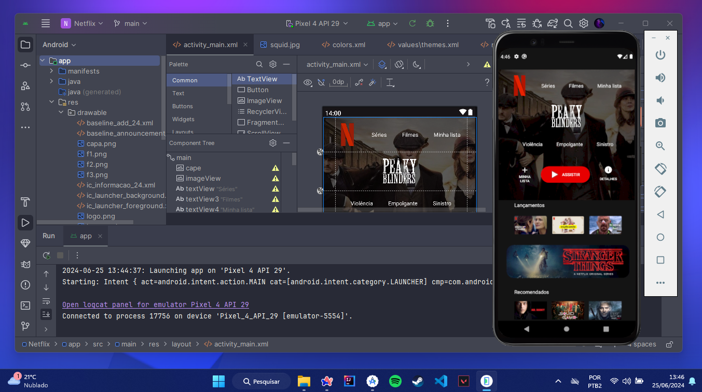

  
  <h1> Netflix: Android Interface Concept </h1>

Interface conceitual da Netflix feita em ConstraintLayout e MaterialDesigner3

## Tecnologias Utilizadas

## Recursos

- Utilização de ConstraintLayout para posicionamento de elementos
- GuideLines auxiliares
- Sistema de Shapeable Image para arredondamento de cantos no Image View
- Configurações e manipulações de style em temas dark/white

## Desenvolvimento

Este projeto tem como objetivo demonstrar a construção de layouts XML utilizando o ConstraintLayout. A interface faz uso de Guidelines para posicionar itens e centralizar textos e botões. Além disso, é empregado o sistema de cores OnPrimary e diversos recursos para configurações de temas escuro/claro. O projeto também se destaca pela responsividade dos elementos, garantindo que a interface se adapte a qualquer tamanho de tela.

 

## Acompanhe o desenvolvimento desta e outras aplicações em

  

<h1 align="center">
   Desenvolvido por Rhyan Araujo Chaves @2024
</h1>

